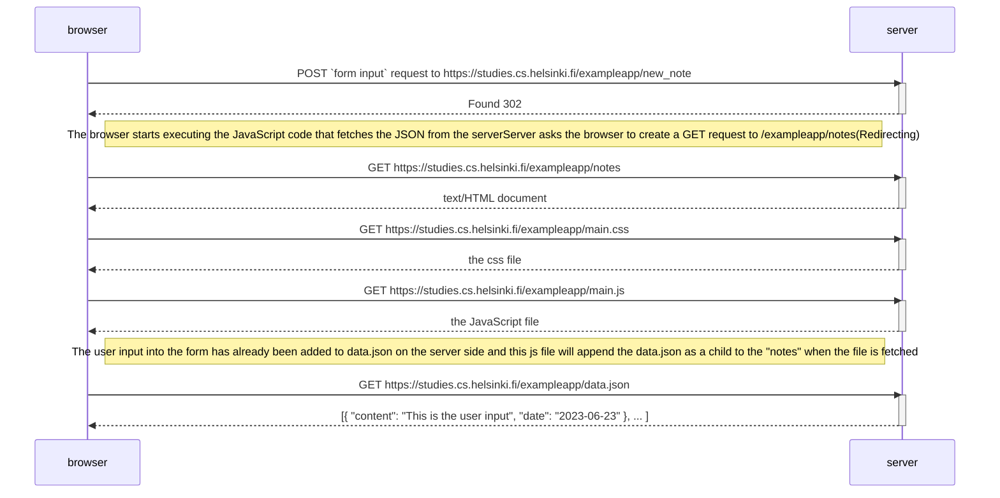

 

```mermaid
 sequenceDiagram
    participant browser
    participant server

    browser->>server: POST `form input` request to https://studies.cs.helsinki.fi/exampleapp/new_note
    activate server
    server-->>browser: Found 302 
    deactivate server
    
    Note right of browser: The browser starts executing the JavaScript code that fetches the JSON from the serverServer asks the browser to create a GET request to /exampleapp/notes(Redirecting)

    browser->>server: GET https://studies.cs.helsinki.fi/exampleapp/notes
    activate server
    server-->>browser: text/HTML document
    deactivate server

    browser->>server: GET https://studies.cs.helsinki.fi/exampleapp/main.css
    activate server
    server-->>browser: the css file
    deactivate server

    browser->>server: GET https://studies.cs.helsinki.fi/exampleapp/main.js
    activate server
    server-->>browser: the JavaScript file
    deactivate server

    Note right of browser:The user input into the form has already been added to data.json on the server side and this js file will append the data.json as a child to the "notes" when the file is fetched

    browser->>server: GET https://studies.cs.helsinki.fi/exampleapp/data.json
    activate server
    server-->>browser: [{ "content": "This is the user input", "date": "2023-06-23" }, ... ]
    deactivate server
```

