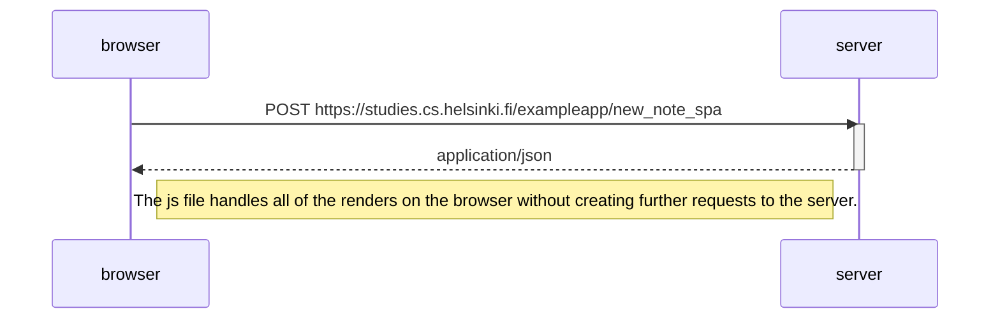

 

```mermaid
 sequenceDiagram
    participant browser
    participant server

    browser->>server: POST https://studies.cs.helsinki.fi/exampleapp/new_note_spa
    activate server
    server-->>browser: application/json 
    deactivate server
    
    Note right of browser: The js file handles all of the renders on the browser without creating further requests to the server. 
   
```

